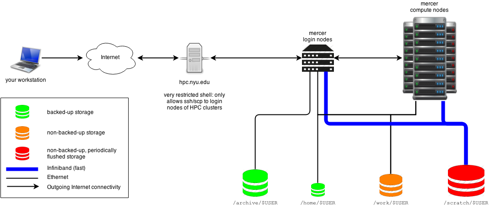

```{r setup, include=FALSE}
knitr::opts_chunk$set(echo = TRUE)
```

# High Performance Computing (HPC)

Today we will:

+ Explain what an HPC or *cluster* is.
+ Practice logging in and accessing RStudio through the OpenOnDemand portal.
+ Set up Git so you can easily work back and forth between the cluster and your local RStudio.

# BU SCC Tech Resources

[Guidance portal](http://www.bu.edu/tech/support/research/)

[Cheatsheet](http://scv.bu.edu/documents/SCC_CheatSheet.pdf)

# Logging In

[SCC Open OnDemand](scc-ondemand.bu.edu/) *Enter cluster username and password*

Then in the top tabs: "Interactive Sessions" -> "RStudio Server". That will take you to a page that requires information about your session.

Enter:

R Version - "3.6.2"

Additional modules - "blast+ sratoolkit"

Number of hours - "2"

Number of cores - "12"

Number of gpus - "0"

Project - "ct-shbioinf"


Click *Launch* and wait for the session to begin. This may take a minute or two depending on the traffic in the queue.

# The "Cluster"

```{r echo=FALSE, out.width='80%', fig.align='center'}

```
](https://devwikis.nyu.edu/display/NYUHPC/Programming+for+Biologists)

[BU Cluster organization](http://www.bu.edu/tech/support/research/computing-resources/tech-summary/)

CPUs are not individually powerful enough to handle very large analyses from multiple users. Instead, HPCs are built by stringing together many individual computers called *Nodes* into a network (the *cluster*) that can be accessed together as a unit and shared by many researchers.

This means that we have to think about computing on these resources in terms of "jobs" instead of interactive typing at the terminal and console. The RStudio job you requested earlier required several things to happen before your RStudio window was available. 

First, the information about the session was entered into the queueing software. This is a program that monitors all users and all nodes across the network. The queue orders job requests and finds available nodes. Then, when your job is at the top of the queue for an available node that is suitable for the parameters you requested then the job starts (here, that means your RStudio window becomes available). Last, starting a job requires sending instructions to start the appropriate software on the chosen compute node. 

Usually your wait for our relatively small jobs will be less than a couple minutes. Larger requests or high traffic might cause longer delays.

# Terminal

Now that you are working on a remote computer we will have to make use of the Terminal app in RStudio. Terminal provides access to the Unix command line where you can run system level commands to do things like create new folders, load software, and view files.

Navigation: Move to folder /projectnb/ct-shbioinf

```{bash, eval=F}
#change directory to shared project folder
cd /projectnb/ct-shbioinf
```

Make your own workspace

```{bash, eval=F}
#make new directory
mkdir yourusername

#changne directory to new 
cd yourusername
```

Where am I?
```{bash, eval=F}
#print working directory
pwd
```

View running and queued jobs (checking on jobs or compute load):

```{bash, eval=F}
qstat -u yourusername
```


# Challenge:

Set up a new R project that links to your current notes repository. Hint: [review R project + git setup](http://bio332.devbioinformatics.org/section1/Rstudio_and_Git.html).

# The NCBI Sequence Read Archive Data Access

View SRA files for eDNA sequencing:

https://trace.ncbi.nlm.nih.gov/Traces/sra/?study=SRP247673

*Access one of the SRR files by ID number

```{bash, eval=F}
mkdir data
cd data
fastq-dump SRR#######
```

# Homework

For your blog this week:

1) Recreate the graphs for read length and quality from last week on one of the SRA files from the eDNA data.

2) 


[Home](bio332.devbioinformatics.org)


